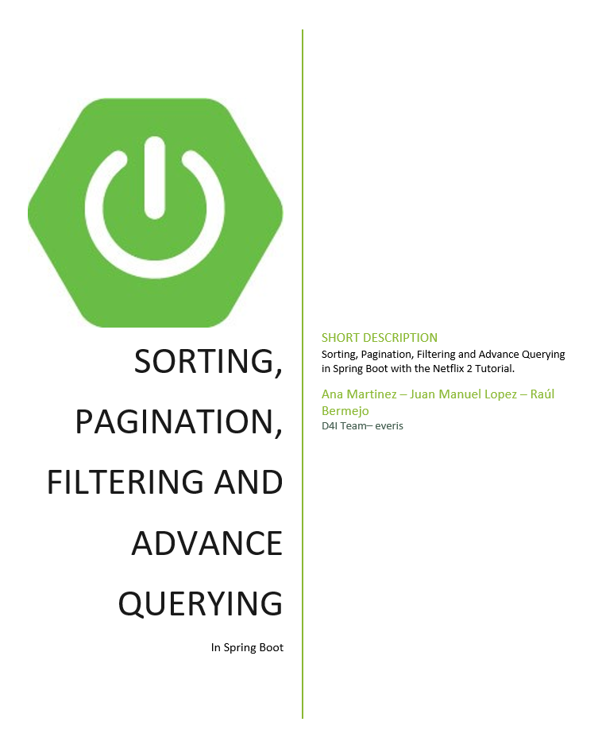
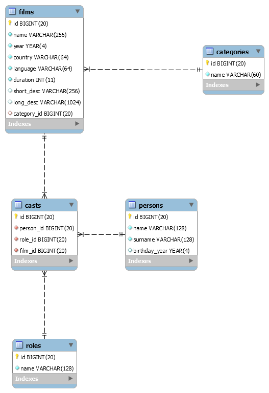
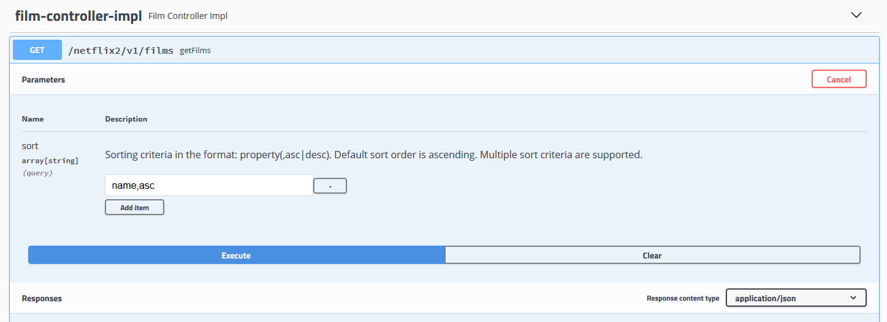
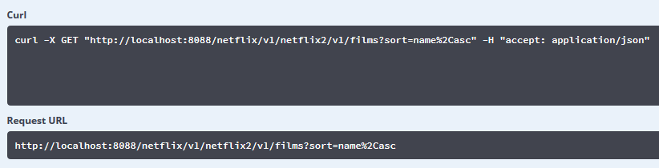
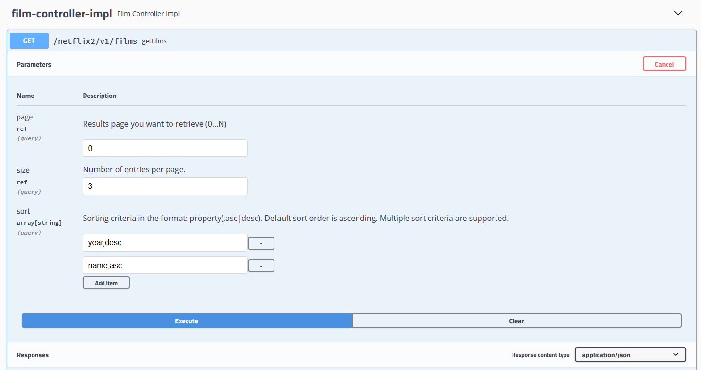
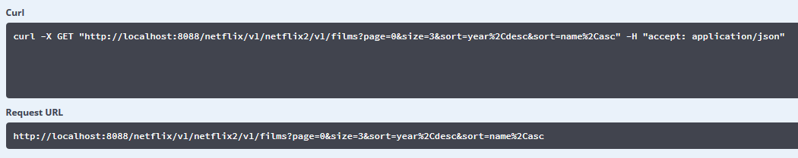

# Contents

[1. Presentation](#presentation)

[2. API Database Model](#api-database-model)

[3. Sorting](#sorting)

[3.1. Database sorting vs sorting programmatically](#database-sorting-vs-sorting-programmatically)

[3.2. Sorting whit Spring Data](#sorting-whit-spring-data)

[3.2.1. Static sorting – Derived Query Named Methods](#static-sorting-derived-query-named-methods)

[3.2.1.1. Static Sorting Pros & Cons](#static-sorting-pros-cons)

[3.2.2. Dynamic Sorting - Sort](#dynamic-sorting---sort)

[3.2.2.1. Endpoints, Swagger and http request](#endpoints-swagger-and-http-request)

[3.2.2.2. Dynamic Sorting Pros & Cons](#dynamic-sorting-pros-cons)

[4. Pagination](#pagination)

[4.1. Pagination whit Spring Data](#pagination-whit-spring-data)

[4.1.1. Page vs Slice vs List](#page-vs-slice-vs-list)

[4.1.2. Endpoints, Swagger and http request](#endpoints-swagger-and-http-request-1)

[5. Filtering](#filtering)

[5.1. Database filtering vs filtering programmatically](#database-filtering-vs-filtering-programmatically)

[5.2. Filtering with Spring Data ](#filtering-with-spring-data)

[5.3. Static Filtering ](#static-filtering)

[5.3.1. Static Filtering – Derived Query Named Methods](#static-filtering-derived-query-named-methods)

[5.3.1.1. Static Filtering (Derived Query methods) Pros and Cons](#static-filtering-derived-query-methods-pros-and-cons)

[5.3.2. Static Filtering - @Query](#static-filtering---query)

[5.3.2.1. JPQL Queries](#jpql-queries)

[5.3.2.2. Native Queries](#native-queries)

[5.3.2.3. Static Filtering (@Query) Pros and Cons](#static-filtering-query-pros-and-cons)

[5.4. Dynamic Filtering - Specifications](#dynamic-filtering---specifications)

[5.4.1. Complex Filters](#complex-filters)

[5.4.2. Filtering Good practices](#filtering-good-practices)

[5.4.3. Specifications and metamodel (wip)](#specifications-and-metamodel)

[5.4.4. Specifications Pros and Cons](#specifications-pros-and-cons)

[\*\*\*\* Bonus Content: Projections (wip)](#bonus-content-projections)

[6. Intro to Advanced Dynamic Querying with Criteria API and Query DSL (wip)](#intro-to-advanced-dynamic-querying-with-criteria-api-and-query-dsl)


# Presentation

In this tutorial we are going to extend the Netflix API that we saw in the 
first bootcamp tutorial. To do so we have a new microservice,
Netflix 2 or the Films API.

This tutorial will not focus on developing new features or User Stories,
but on adding functionality to the existing endpoint *getFilms* in the
FilmController.

If you are looking for help on a single thing, feel free to use the
Table of Contents at the beginning to jump to what you need and ignore
the rest. All sections of the tutorial are mostly independent of each
other.

A repository with the base code can be found at:

<https://gitlab.com/development-for-industry/training/java/netflix/bootcamp/netflix2>

  -  A branch for each of the chapters in this
    tutorial with multiple examples mentioned of the point explained is
    indicated with the previous image. You are encouraged to create your
    own branch from develop and follow along, experiment and create your
    own base code.

  - Scripts to create and populate the database tables can be found
    under resources/db.

A basic working knowledge of Spring Boot and Swagger is presupposed for
this tutorial. Lombok is used for convenience.

The Hibernate.SQL has been set to DEBUG in the project, so feel free to
check how the hibernate SQL queries thrown to the database change as we
add elements to our repository methods through this tutorial.

It is important to note that all the elements contained in this tutorial
form a toolset that can be mixed up in most cases to obtain whatever
permutation is needed. If one tool does not play well with others, it
will be so indicated.


# API Database Model



*Figure 1. Database Model*

The database model has been optimized to be used with this tutorial, so
it does not necessarily correspond a real use case.

For example, a single category has been restricted per film instead of
multiple ones as it would have sense in a real case use. And Short
description, which defines in one sentence the kind of film it is, it is
a concatenation of categories in most cases.

Such decisions obey to the need to give a simple yet powerful database
structure that allows us to create multiple query, filtering and
ordering options with ease.


# Sorting

 

*Repository branch:*

*$ git checkout sorting*

----------------------------------------

## Database sorting vs sorting programmatically

Performance and scalability are the two major concerns regarding sorting
on the client side, and unless very complex sorting is required, really
small data volumes are being used, or any other
**very** well defined and justified reason,
sorting should be done on the persistence layer.

Sorting is one of the key basic functionalities included in any database
manager, and their algorithms are well developed, well tested and highly
efficient, especially with high data volumes.

Not only this, the use of indexed keys to sort in database reduces the
sorting request as much as possible making the sorting in the database
very fast and efficient. Creating indexes in the has a price thought, so
the decision to use them should be balanced with its usage as to do not
affect overall database performance.


## Sorting whit Spring Data

Spring gives us the tools to easily sort our query results at the
persistence layer.

Whether we use static or dynamic sorting, hibernate ultimately
translates it into a SQL query with the “order by” added at the end:

```sql
2020-0x-xx 16:26:17.343 DEBUG 18924 --- [nio-8088-exec-3] org.hibernate.SQL                        : 
    select
        film0_.id as id1_2_,
        film0_.category_id as category9_2_,
        film0_.country as country2_2_,
        film0_.duration as duration3_2_,
        film0_.language as language4_2_,
        film0_.long_desc as long_des5_2_,
        film0_.name as name6_2_,
        film0_.short_desc as short_de7_2_,
        film0_.year as year8_2_ 
    from
        films film0_

```

*Code Snippet 3.a. hibernate SQL query to list all films without ordering*

```sql
2020-0x-xx 16:26:17.343 DEBUG 18924 --- [nio-8088-exec-3] org.hibernate.SQL                        : 
    select
        film0_.id as id1_2_,
        film0_.category_id as category9_2_,
        film0_.country as country2_2_,
        film0_.duration as duration3_2_,
        film0_.language as language4_2_,
        film0_.long_desc as long_des5_2_,
        film0_.name as name6_2_,
        film0_.short_desc as short_de7_2_,
        film0_.year as year8_2_ 
    from
        films film0_ 
    order by
        film0_.year desc, 
        film0_.name desc
```


*Code Snippet 3.b.Resulting hibernate SQL query from a sorting method
with Spring Data.*


### Static sorting – Derived Query Named Methods

When sorting the data by a fixed column in our data is a permanent part
of our algorithm, we can use the *OrderBy* key in the derived named
method in the Spring Repository:

```Java
@Repository
public interface FilmRepository extends JpaRepository<Film, Long> {

    List<Film> findAllByOrderByYearDesc();
}

```
*Code Snippet 3.c Static Sorting with named method.*

No other code is necessary at controller or service methods.


#### Static Sorting Pros & Cons

- :x: CON: Only a simple ordering can be done, by a single element, added at the end of the method name.

- :x: CON: the queries can get very long and difficult to read as the complexity rises.

- :white_check_mark: PRO: very easy to implement, almost no code involved, spring does all the work behind the curtain

- :white_check_mark: PRO: ordering direction can be indicated.


### Dynamic Sorting - Sort

If we need to order by more than one element, or want to choose our
ordering element at execution time, we can use the *Sort* element of
Spring Data.

At repository level we must do nothing; our Repositories extend
JpaRepository, which itself extends PaginationAndSortingRepository. This
allows us to use findAll(Sort sort) without having to implement it in
the repository, it is defined by default. Likewise, Sort can also be
used as parameter with any other query defined with the method name.

```Java
@Repository
public interface FilmRepository extends JpaRepository<Film, Long> {

    List<Film> findAllByOrderByYearDesc();

    List<Film> findAllByCategory_Id(Integer category, Sort sort);

}
```

*Code Snippet 3.d Named method with Sort added as parameter.*

The Sort element can either be created in the service layer or be
collected by the controller as user input data and passed directly to
the repository via the service layer.

```Java
@Override
public List<FilmRest> getFilmsSortedProgrammatically() {

    final Sort sortProgrammatically = Sort.by(Sort.Direction.ASC, "year")
                                              .and(Sort.by(Sort.Direction.DESC, "name"));

    return filmRepository.findAll(sortProgrammatically).stream()
                   .map(film -> modelMapper.map(film, FilmRest.class))
                   .collect(Collectors.toList());
}
```

*Code Snippet 3.e Sorting created at service layer.*

Multiple sorting fields can be defined and are additive; in that case
**definition order is important** as it
will be ordered by the first field, THEN the second if possible, THEN
the third, etc.


#### Endpoints, Swagger and http request

Should we want our sorting to be defined by our user, we will use the
Sort element as input parameter in our controller.

It is a well-known issue of Swagger Springfox that Sort and Pageable
Interfaces cannot be used directly with any of the @Param attributes, as
swagger only lists its implicit parameters (which are not usable per
se).

To correctly document and use the controller, we will use both the
*@ApiIgnore* and *@ApiImplicitParam*. *@SortDefault* allows us to
declare a predefined sorting, by element and direction (ASC by default).

```Java
@RestController
@RequestMapping(RestConstants.APPLICATION_NAME + RestConstants.API_VERSION_1 + RestConstants.RESOURCE_FILM)
public class FilmControllerImpl implements FilmController {

    @Autowired
    private FilmService filmService;

    @Override
    @ApiImplicitParam(name = "sort", allowMultiple = true, dataType = "string", paramType = "query",
            value = "Sorting criteria in the format: property(,asc|desc). " +
                            "Default sort order is ascending. " +
                            "Multiple sort criteria are supported.")
    @ResponseStatus(HttpStatus.OK)
    @GetMapping(produces = MediaType.APPLICATION_JSON_VALUE)
    public NetflixResponse<List<FilmRest>> getFilms(
            @ApiParam
            @ApiIgnore("default params not useful. Using ApiImplicitParam instead")
            @SortDefault(value = "year", direction = Sort.Direction.ASC) final Sort sort) {
        return new NetflixResponse<>(CommonConstants.SUCCESS, String.valueOf(HttpStatus.OK), CommonConstants.OK,
                filmService.getFilmsSortedDynamically(sort));
    }

}
```

*Code Snippet 3.f Controller with correct swagger definition*

The resulting swagger:



*Figure 8. Swagger showing operation, URL and input parameters.*



*Figure 9. Swagger showing curl and request URL (%2C is the Hex coding of
the ASCII character ‘,’)*

The Response Json has not been included in this case due to its length;
please use the repository to generate it yourself and do indeed observe
the ordered result.


#### Dynamic Sorting Pros & Cons

- :white_check_mark: PRO: complex ordering by more than one element can easily be done.

- :white_check_mark: PRO: ordering decided at execution time, not predefined.

- :white_check_mark: PRO: plays nicely with other Spring Data methods and tools, like method
names.


# Pagination

 

*Repository branch:*

*$ git checkout pagination*

---------------------------------------------------------

Paginate the results of a query means to “chunkify” its results. In
other words, instead or returning all the results of a query, only a
subset will be selected.

Pagination is especially useful with queries that return large sets of
data, as it is common to display only a part of the resulting data as to
no overwhelm the user.

To paginate we need to indicate in the SQL query the *limit* (number of
registers we want to obtain from the database) and the *offset* (how
many are ignored before taking the indicated number). It is common, as a
user, to work instead with *page size* (how many registers I want) and
*page number* (which page I want to access). Those two values ultimately
translate to offset and limit in the query, and the conversion is done
by Spring Data.

## Pagination whit Spring Data

Spring gives us the tools to easily paginate our query results at the
persistence layer. Similarly as sorting did, pagination ultimately
translates into a SQL hibernate query where a subset of registers are
selected:

```sql
    select
        film0_.id as id1_2_,
        film0_.category_id as category9_2_,
        film0_.country as country2_2_,
        film0_.duration as duration3_2_,
        film0_.language as language4_2_,
        film0_.long_desc as long_des5_2_,
        film0_.name as name6_2_,
        film0_.short_desc as short_de7_2_,
        film0_.year as year8_2_ 
    from
        films film0_ 
    order by
        film0_.name desc limit ?,
        ?
```

*Code Snippet 4.a Hibernate SQL query where only a subset of elements are
returned.*

The Spring Data result includes not only the requested data, but also
additional pagination information: the total number of entries in the
database, if the data set is empty, the number of pages, etc.

To do so, the total number of registers in the table is calculated:

```sql
   select
        count(film0_.id) as col_0_0_ 
    from
        films film0_
```

*Code Snippet 4.b Hibernate SQL query automatically generated when
paginating.*

To paginate win Spring, we simply must use the Pageable interface as
a parameter in the repository. As with sorting, we must do nothing at
repository level; our Repositories extend JpaRepository, which itself
extends PaginationAndSortingRepository. This allows us to use
findAll(Pageable pageable) without having to implement it in the
repository, it is defined by default.

Like Sort, Pageable is a tool that can be used as parameter with queries
defined with other methods, like derived named methods:

```Java
@Repository
public interface FilmRepository extends JpaRepository<Film, Long> {

    Slice<Film> findAllByCategory_Id(Integer category, Pageable pageable);

```

*Code Snippet 4.c Using pageable with a named method. The query returns,
in this case, a slice.*

Notice that in this case the use of pagination implies that the return
type is not a Collection anymore, but a Slice, a data structure that
will be used in the remaining layers (service and controller).

Pageable could be defined at the service layer, but it does not has so
much sense as it is a tool to be used by the user to be able to access
the required chunk of data that it needs. Therefore, the pageable
information will come from the controller in most of the cases.

At the service layer though, it is interesting the use of the function
*map* of the Page interface, as it allows us to use a Function to map
the results of the page to any other format (json in our code).

```Java
@Repository
public interface FilmRepository extends JpaRepository<Film, Long> {

    Slice<Film> findAllByCategory_Id(Integer category, Pageable pageable);
```

*Code Snippet 4.d Using the map Function to transform a page of entities
into a page of Jsons.*


### Page vs Slice vs List

Page, Slice and List are all possible returns of a pageable query in the
repository. In all cases, the data content of the response will be the
same given the same pageable parameter, what will be different will be
the wrapper around the content.

List offers no wrapper and returns the content naked, even though the
database entries have been indeed paginated and only the chunk of
information defined by pageable is returned (X rows of the table, with
an offset of Y).

Having Page and Slice, the Page interface wrapper actually extends from
the Slice one, and thus contains a little bit more of information.

The main difference between both of them is that Page does a secondary
call to the database to count all the entries in the table, and with
this information returns the total of pages and the total of elements in
the table.

Slice does not, and thus can be more efficient. Slice might be enough in
simplified user interfaces where only the next and previous page buttons
are available and there is no need to know the total of pages.

<table>
<thead>
<tr class="header">
<th>Slice Json information</th>
<th>Page Json Information</th>
</tr>
</thead>
<tbody>
<tr class="odd">
<td>
"pageable": <em>{<br />
</em>"sort": <em>{<br />
</em>"sorted": true,<br />
"unsorted": false,<br />
"empty": false<br />
<em>}</em>,<br />
"offset": 0,<br />
"pageNumber": 0,<br />
"pageSize": 2,<br />
"paged": true,<br />
"unpaged": false<br />
<em>}</em>,<br />
"size": 2,<br />
"number": 0,<br />
"sort": <em>{<br />
</em>"sorted": true,<br />
"unsorted": false,<br />
"empty": false<br />
<em>}</em>,<br />
"numberOfElements": 2,<br />
"first": true,<br />
"last": false,<br />
"empty": false
</td>
<td>
"pageable": <em>{<br />
</em>"sort": <em>{<br />
</em>"sorted": true,<br />
"unsorted": false,<br />
"empty": false<br />
<em>}</em>,<br />
"offset": 0,<br />
"pageNumber": 0,<br />
"pageSize": 2,<br />
"unpaged": false,<br />
"paged": true<br />
<em>}</em>,<br />
"last": false,<br />
"totalPages": 20,<br />
"totalElements": 39,<br />
"size": 2,<br />
"number": 0,<br />
"sort": <em>{<br />
</em>"sorted": true,<br />
"unsorted": false,<br />
"empty": false<br />
<em>}</em>,<br />
"numberOfElements": 2,<br />
"first": true,<br />
"empty": false
</td>
</tr>
</tbody>
</table>

*Code Snippet 4.e Slice vs Page information returned in the Json.*


### Endpoints, Swagger and http request

As with Sort, Swagger with SpringFox needs to use the @ApiIgnore and
@ApiImplicitParams to correctly show the request parameters that control
pagination: page, size and sort are used.

The sort parameter is exactly the same as the one described previously;
it is part of the Pageable interface, as it is common to order the
results by one or more columns before returning the desired table rows.

Using Pageable as input parameter in our controller means that Jackson
is going to do all the work deserializing the pageable information: it
takes whichever of the parameters (page, size and sort) are present as
request params and construct a Pageable with them. The parameters not
present are taken as default value: 0 for page, 10 for size and unsorter
for sort.

I can also use the @PageableDefault to set my own defaults.

```Java
@RestController
@RequestMapping(RestConstants.APPLICATION_NAME + RestConstants.API_VERSION_1 + RestConstants.RESOURCE_FILM)
public class FilmControllerImpl implements FilmController {

    @Autowired
    private FilmService filmService;

    @Override
    @ApiImplicitParams({
            @ApiImplicitParam(name = "page", dataType = "integer", paramType = "query",
                    value = "Results page you want to retrieve (0..N)", defaultValue = "0"),
            @ApiImplicitParam(name = "size", dataType = "integer", paramType = "query",
                    value = "Number of entries per page.", defaultValue = "8"),
            @ApiImplicitParam(name = "sort", allowMultiple = true, dataType = "string", paramType = "query",
                    value = "Sorting criteria in the format: property(,asc|desc). " +
                                    "Default sort order is ascending. " +
                                    "Multiple sort criteria are supported.")
    })
    @ResponseStatus(HttpStatus.OK)
    @GetMapping(produces = MediaType.APPLICATION_JSON_VALUE)
    public NetflixResponse<Slice<FilmRest>> getFilms(
            @ApiIgnore("ignored because too much stuff. Selection done instead with ApiImplicitParams")
            @PageableDefault(sort = "id", direction = Sort.Direction.ASC, size = 8) final Pageable pageable) {
        return new NetflixResponse<>(CommonConstants.SUCCESS, String.valueOf(HttpStatus.OK), CommonConstants.OK,
                filmService.getPageOfFilms(pageable));

```

*Code Snippet 4.f Controller with swagger to document and user Pagination.*

The resulting swagger is:



*Figure 14.Swagger showing the URL and the input parameters.*



*Figure 15. Swagger showing the curl and Request URL with parameters*

The returned Json, with the paginated data and all the pagination info:

```Json
{
  "status": "Success",
  "code": "200 OK",
  "message": "OK",
  "data": {
    "content": [
      {
        "id": 11,
        "name": "1917",
        "year": 2019,
        "country": "United States",
        "language": "English",
        "duration": 119,
        "shortDescription": "war film",
        "longDescription": "April 6th, 1917. As a regiment assembles to wage war deep in enemy territory, two soldiers are assigned to race against time and deliver a message that will stop 1,600 men from walking straight into a deadly trap."
      },
      {
        "id": 15,
        "name": "American Factory",
        "year": 2019,
        "country": "United States",
        "language": "English",
        "duration": 110,
        "shortDescription": "documentary film",
        "longDescription": "In post-industrial Ohio, a Chinese billionaire opens a factory in an abandoned General Motors plant, hiring two thousand Americans. Early days of hope and optimism give way to setbacks as high-tech China clashes with working-class America."
      },
      {
        "id": 13,
        "name": "Bombshell",
        "year": 2019,
        "country": "United States",
        "language": "English",
        "duration": 108,
        "shortDescription": "american drama film",
        "longDescription": "A group of women take on Fox News head Roger Ailes and the toxic atmosphere he presided over at the network."
      }
    ],
    "pageable": {
      "sort": {
        "sorted": true,
        "unsorted": false,
        "empty": false
      },
      "offset": 0,
      "pageSize": 3,
      "pageNumber": 0,
      "paged": true,
      "unpaged": false
    },
    "totalPages": 13,
    "last": false,
    "totalElements": 39,
    "size": 3,
    "number": 0,
    "sort": {
      "sorted": true,
      "unsorted": false,
      "empty": false
    },
    "numberOfElements": 3,
    "first": true,
    "empty": false
  }
}
```

*Code Snippet 4.g Table with Json resulting of pagination with previously
indicated parameters*


# Filtering

Filtering is selecting only the rows of the database table that satisfy
certain requisites.


## Database filtering vs filtering programmatically

As with sorting, performance and scalability are the two major concerns
regarding filtering on the client side, with the added clear misuse of
unnecessary data transfer from the database to the client, as part of
the data will be eliminated as result of the filtering itself.

Filtering is an essential feature of querying and thus should always be
relegated to the database.


## Filtering with Spring Data

Like the rest of the elements in this tutorial, filtering in Spring Data
ultimate translates into a hibernate SQL query:

```sql
    select
        film0_.id as id1_2_,
        film0_.category_id as category9_2_,
        film0_.country as country2_2_,
        film0_.duration as duration3_2_,
        film0_.language as language4_2_,
        film0_.long_desc as long_des5_2_,
        film0_.name as name6_2_,
        film0_.short_desc as short_de7_2_,
        film0_.year as year8_2_ 
    from
        films film0_ 
    where
        film0_.duration>?
```

*Code Snippet 5.a Hibernate SQL query resulting from filtering*

## Static Filtering

 

*Repository branch:*

*$ git checkout filtering*

--------------------------------------------------------

Static filtering is used when the filtering parameters are known,
obligatory and do not change (are always the same, we
<span class="underline">always</span> want to filter by a certain
criteria).

In Spring Boot we can achieve it with several tools, and all of them
play nicely with sorting and pagination. In other words, we can combine
all this tools as we see fit.


### Static Filtering – Derived Query Named Methods

Derived Query Named Methods are pretty powerful by themselves and allow
us to do a bunch of things by concatenating a series of keywords and the
names of the properties of our entities.

All named methods fulfill the following structure: Introducer +
delimiter+*By*+criteria (+And/Or+Criteria)+(OrderBy)

  - **Introducer**: the three most common are
    *find*, *findAll* and *count*.

  - **Delimiters**: (Optional)
    
      - *Distinct* (to eliminate duplicates)
    
      - *First* (to find the first row matching the criteria)

  - **By**: used always, part of the Named
    method structure.

  - **Criteria**: (Optional) where the actual
    filtering occurs. A condition, or series of conditions introduced by
    *And* and *Or* that must be fulfilled one after the other. All
    criteria follow the structure: property + comparator, being those
    last ones:
    
      - *Is, Equals*: (optional) they can be used to improve readability.
    
      - *IsNot*
    
      - *IsNull, IsNotNull*
    
      - *True,False*
    
      - *StartingWith, EndingWith, Containing, Like*: used with strings.
    
      - *LessThan, LessThanEqual, Between, GreaterThan, GreaterThanEqual*
    
      - *In*: we can supply a collection of values to be matched against.
    
      - *After, Before*: used with dates.
    
      - \_ : we are accessing properties nested inside other properties
        (Example: Category\_id, in java, would be equivalent to do
        Category.getId()). In hibernate it ultimately translates to a
        Joint operation.

  - **OrderBy**: (Optional) as explained in
    sorting.

```Java
@Repository
public interface FilmRepository extends JpaRepository<Film, Long> {

    List<Film> findAllByDurationGreaterThan(Integer duration);

    /*short description has been used in the database to store a descriptive string with categories,
     * so we can now use it to find a main category and subcategories*/
    List<Film> findAllByCategory_IdAndShortDescriptionContaining(Integer categoryId, String secondaryCategory);

    List<Film> findTop10ByLanguageInOrderByLanguageDesc(Collection<String> possibleLanguages);

    Optional<Film> findFirstByYearBeforeAndDurationIsNotNullAndCountry(Year year, String country);

}
```

*Code Snippet 5.b Some examples of Named Methods*


#### Static Filtering (Derived Query methods) Pros and Cons

The list of pros and cons of filtering with Derived Query Methods is
very similar to the sorting one, as the tool is the same:

- :x: CON: the queries can get very long and difficult to read as the
complexity rises. It is not possible to add line breaks to make them
more readable.

- :x: CON: null **IS** a possible value in the
database, so I cannot use it to set optional parameters and use it in
query.

- :white_check_mark: PRO: very easy to implement, almost no code involved, spring does all
the work behind the curtain

- :white_check_mark: PRO: offer a multitude of filtering criteria right out of the hood. Idea
for simple easy cases.


### Static Filtering - @Query

Sprint Data allows us to define our own static queries as static
strings. To do so, we can use the @Query over the name of the repository
function associated to it. Queries can be written using JPQL or
nativeSQL (the SQL flavor of the database being used in the project).

In both cases, we can pass parameters to the query using
(@Param(“nameOfTheParam”) Type name) as parameter of our function, and
*:nameOfTheParam* in the query itself. The name of the function
parameter and the query parameter do not have to match, is the value
inside @Param that will be used in the query:


```Java
@Query(value = "select f from Film f where f.language in :languages ")
List<Film> myOwnQueryWithAListAsParam(
        @Param("languages") Collection<String> languageCollection);

```

*Code Snippet 5.c Example of @Query with parameters*

#### JPQL Queries

The big selling point for JPQL queries is that they allow us to write
queries based on the entities model. This makes the queries very
readable and comfortable to write, but at the expense of having
Hibernate generate the actual SQL query for us. Such translation might
be inefficient, especially in complex queries; we lose control on the
number of queries used and their complexity.

This makes it indicated in cases where performance might not be an
issue.

JPQL is database agnostic, it does not really mind what lies underneath
it. It will be Hibernate who does the work to adapt the query to the
database. That assures the independence of the Database Implementation.

```Java
@Query(value = "select f from Film f where f.year = :year and f.category.name = :name")
List<Film> myOwnJPQLQueryFunctionFilterByYearAndCategory(
        @Param("year") Year year,
        @Param("name") String categoryName);
```

*Code Snippet 5.d JPQL Query*

```sql
    select
        film0_.id as id1_2_,
        film0_.category_id as category9_2_,
        film0_.country as country2_2_,
        film0_.duration as duration3_2_,
        film0_.language as language4_2_,
        film0_.long_desc as long_des5_2_,
        film0_.name as name6_2_,
        film0_.short_desc as short_de7_2_,
        film0_.year as year8_2_ 
    from
        films film0_ cross 
    join
        categories category1_ 
    where
        film0_.category_id=category1_.id 
        and film0_.year=? 
        and category1_.name=?
```

*Code Snippet 5.e Hibernate translation of the previous query*


#### Native Queries

Native queries throw to the database the string EXACTLY as is written in
the @Query value. This makes the queries less readable as soon as they
get slightly complex, but assure us a single Database request and thus
full control on the performance, especially in complex cases or in cases
where it might be an issue.

Native queries have also the downside of being Database dependent. This
means that should the database underneath change, the Native Query will
have to be rewritten.

```Java
@Query(nativeQuery = true,
        value = "select * " +
                       "from films " +
                       "where year = :year " +
                       "    and category_id = (select id from categories where name = :name);")
List<Film> myOwnNativeQueryFunctionFilterByYearAndCategory(
        @Param("year") Integer year,
        @Param("name") String categoryName);

```

*Code Snippet 5.f Native query returning the same result as JPQL query*

```sql
2020-xx-xx 09:41:50.204 DEBUG 20632 --- [nio-8088-exec-4] org.hibernate.SQL                        : 
    select
        * 
    from
        films 
    where
        year = ?     
        and category_id = (
            select
                id 
            from
                categories 
            where
                name = ?
        );

```

*Code Snippet 5.g Hibernate throws exactly the same code to the database.*


#### Static Filtering (@Query) Pros and Cons

- :white_check_mark: PRO: very easy to use.

- :white_check_mark: PRO: with Native Queries, full control of what is thrown to the
database.

- :white_check_mark: PRO: with JPQL high code readability

- :x: CON: queries are static strings, cannot be modified at runtime

- :x: CON: parameters in the queries are obligatory, cannot be omitted (and
NULL **IS** a value)

- :x: CON: with Native Queries, database dependency

- :x: CON: with JPQL, possible loss of performance.

- :x: CON: the queries are strings, there is no type checking of the
parameters at compilation time. This means that if I change the code,
the compiler will not advise me to also change the related queries, and
they will fail at execution time.


## Dynamic Filtering - Specifications

 

*Repository branch:*

*$ git checkout filtering\_dynamic*

-----------------------------------------

Dynamic filter is used when we have parameters that are optional and not
required; we only know at runtime which parameters are coming from the
controller (the user) and thus what we will filter by.

In this case, the tool to use is Spring Data Specifications.
Specifications is a wrapping of the Criteria API; it makes the code a
little more readable and allows us the reuse of predicates.

To Use Specifications, the repository must expand
JpaSpecificationExecutor\<T\>:

```Java
@Repository
public interface FilmRepository extends JpaRepository<Film, Long>, JpaSpecificationExecutor<Film> {

}
```
*Code Snippet 5.h Repository extends JpaRepository and
JpaSpecificationExecutor.*

Specification\<T\> is an interface that describes a Predicate over an
Entity. It consists of a single method, which we can easily override
with a lambda function:

```Java
public interface Specification<T> {
  Predicate toPredicate(Root<T> root, CriteriaQuery query, CriteriaBuilder cb);
}
```
*Code Snippet 5.i Specification interface.*

```Java
public static Specification<Film> isYearEqual(final Year year) {
    return (root, query, criteriaBuilder) -> criteriaBuilder.equal(root.get("year"), year);
}
```

*Code Snippet 5.j Example of a very simple specification.*


### Complex Filters

Specifications can be “joined” with the static functions AND, OR and
NOT, to be used as the Boolean operators. To improve readability, the
sequence can start with the function “Where”:

```Java
Specification.where(condition1).and(condition2).and(Specification.not(condition3))
```

*Code Snippet 5.k Example of generic filtering sequence.*

```Java
private Specification<Film> complexFilter(final FilteringParameters filters) {
    return Specification.where(ReusableFilmSpecifications.hasName(filters.getName())
                                    .and(ReusableFilmSpecifications.isYearEqual(Year.of(filters.getYear()))));
}

```

*Code Snippet 5.l filtering by two elements*

As with the Boolean operators, the order of the operations, and the use
of parenthesis may change the result of the filter:

```Java
private Specification<Film> staticFilteringOrderExample1() {
    /*category = 9 && subcategory = drama || subcategory = comedy
    * returns all biographical dramas OR comedies*/
    return Specification.where(ReusableFilmSpecifications.isCategoryEqual(9))
                   .and(ReusableFilmSpecifications.hasShortDescription("drama"))
                   .or(ReusableFilmSpecifications.hasShortDescription("comedy"));
}

private Specification<Film> staticFilteringOrderExample2() {
    /*category = 9 && (subcategory = drama || subcategory = comedy)
    * returns all biographical dramas OR biographical comedies*/
    return Specification.where(ReusableFilmSpecifications.isCategoryEqual(9))
                   .and(ReusableFilmSpecifications.hasShortDescription("drama")
                                .or(ReusableFilmSpecifications.hasShortDescription("comedy")));
}
```

*Code Snippet 5.m Both filters use the same parameters, in the same
order; the parenthesis change the meaning of the final filter. The
indentation of the operations created by the IDE may help to read the
operator order.*


### Filtering Good practices

At controller level, pack all filtering options in a single object. If
the filtering options change, the controller signature will change (as
it should be, it changes the API functionality) but it will be
transparent to the service layer.

Complex filters will be defined at service layer, which knows the
entities and their properties. Controller should be agnostic of the
persistence layer; they will simply collect the filtering data and pass
it to the service.

The use of predicates allows me to define reusable filters. They can be
packed all in a class, which will be stored in the persistence layer, as
Specifications have a direct correlation with the entities.


### Specifications and metamodel

Using the metamodel instead of strings to define our specifications
constitutes a little bit more of work on the project definition, but it
allows us to do *type check at compilation time.*

(wip)

### Specifications Pros and Cons

- :white_check_mark: PRO: filtering is decided at runtime, depending on the parameters
passed.

- :white_check_mark: PRO: filters can be reused.

- :white_check_mark: PRO: with the metamodel, we can do type check at compilation time.

- :x: CON: without the metamodel, the name of the entities properties is coded
as a String, and thus cannot be checked at compilation time.

# \*\*\*\* Bonus Content: Projections

(wip)

# Intro to Advanced Dynamic Querying with Criteria API and Query DSL

Combining all the tools seen up until now we will be able to solve 90%
of the functionality required in our projects. What happens with that
remaining 10%? In those cases we can use Advanced Dynamic Querying.

(wip)
